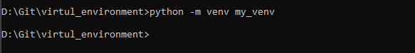
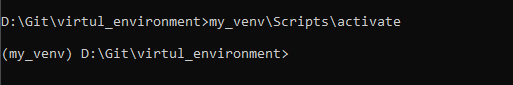
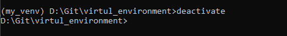

# Виртуальное окружение


#### Переходим в рабочий каталог, создаем виртуальное окружение 

````python
python -m venv my_venv 
````
 - где "my_venv" название папки куда будет совершена установка дистрибутива для вирта
#### После установки требуется активировать окружение командой:
 
```python
my_venv\Scripts\activate
```

- В командной строке должен появиться префикс (my_venv)



- значит виртуальное окружение активировано и можно теперь устанавливать нужные библиотеки

>#### Для проверки установленных библиотек можно воспользоваться командой:
```python
pip freeze
```


- для деактивации виртуального окружения напишите команду:
```python
deactivate
```


#### создайте .env файл в корневой папке вашего проекта

* поместите в него переменные с данными, которые вы хотите скрыть
* добавьте файл ".env" в gitignore
* 
